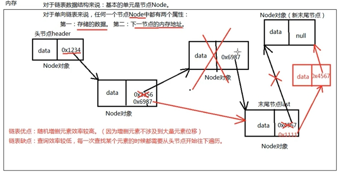

节点是单向链表中基本的单元，每个节点 Node 都有两个属性：
- 存储的数据
- 下一个节点的内存地址

<!-- more -->



**Node 类**

```java
public class Node {
	// 存储的数据
	Object element;

	// 下一个节点的内存地址
	Node next;

	public Node() {
	}

	public Node(Object element, Node next) {
		this.element = element;
		this.next = next;
	}
}
```

**Link类**

```java
public class Link {
	// 头节点
	Node header = null;

	int size = 0;

	public int size() {
		return size;
	}

	// 向链表中添加元素的方法（向末尾添加）
	public void add(Object data) {
		// 创建一个新的节点对象
		// 让之前单链表的末尾节点 next 指向新节点对象
		// 有可能这个元素是第一个，也可能是第二个，也可能是第三个
		if (header == null) {
			// 说明还没有节点
			// new 一个新的节点对象，作为头节点对象
			// 这个时候的头节点既是一个头节点，又是一个末尾节点
			header = new Node(data, null);
		} else {
			// 说明头不是空！
			// 头节点已经存在了！
			// 找出当前末尾节点，让当前末尾节点的next是新节点
			Node currentLatNode = findLast(header);
			currentLatNode.next = new Node(data, null);
		}
		size++;
	}

	/**
	 * 
	 * @Description: 专门查找末尾节点的方法
	 * @param node
	 * @return
	 */
	private Node findLast(Node node) {
		if (node.next == null) {
			// 如果一个节点的 next 是 null
			// 说明这个节点是末尾节点
			return node;
		}
		// 程序能到这里说明：node 不是末尾节点
		return findLast(node.next);
	}

	// 删除链表中某个数据的方法
	public void remove(Object obj) {
	}

	// 修改链表中某个数据的方法
	public void modify(Object newObj) {
	}

	// 查找链表中某个元素的方法
	public int find(Object obj) {
		return 1;
	}
}
```

**Test类**

```java
public class Test {
	public static void main(String[] args) {
		Link link = new Link();
		link.add(100);
		link.add(200);
		link.add(300);
		System.out.println(link.size()); // 3
	}
}
```

