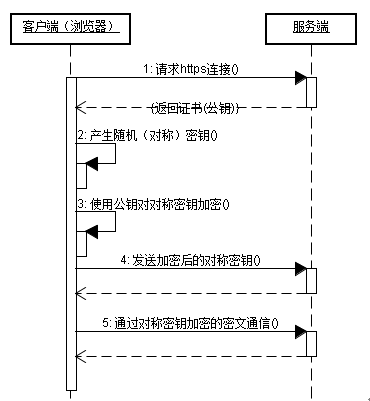

## 与 Http 的区别
- Http 的 URL 以 http:// 开头，而 Https 的 URL 以 https:// 开头
- Http 默认80端口，Https 默认443端口
- Http 处在应用层，Https 处在传输层
- Http 明文传输，Https 通过ssl加密和身份认证
- Http无需认证证书，Https 需要认证证书 

## Https 定义

超文本传输安全协议，Http 的安全版：Http + SSL加密处理（一般是SSL安全通信线路）+ 认证 + 完整性保护

## SSL 过程

SSL是一种公认的加密协议，在网络传输层上提供一种**基于 非对称密钥和对称密钥 技术**用于浏览器和服务器安全连接的技术

1. 服务端把自己的公钥a发给证书颁发机构，向证书颁发机构申请证书
2. 证书颁发机构有一对公钥私钥，机构用私钥加密a，并且通过服务端网址等信息生成一个证书签名，证书签名也用私钥加密，证书制作完成，机构把证书发给服务端
3. 客户端向服务端请求通信时，服务端把证书发给客户端
4. 因为各大浏览器和操作系统已经维护了所有权威证书机构的名称和公钥，客户端知道证书的颁发机构，就可以从本地拿出对应的公钥进行解密
5. 客户端按照同样的签名规则，自己也生成一个证书签名，如果两个签名一致，则证书有效
6. 然后客户端用公钥解密a
7. 客户端生成自己的对称加密密钥b，用a加密b，发给服务端
8. 服务端用自己的私钥解开加密，得到b，然后，客户端和服务端就可以用b进行对称加密的通信

## 对称加密与非对称加密

**对称加密(公开密钥加密)**

- 加密和解密都会用到同一个密钥，如果密钥被攻击者获得，此时加密就失去了意义。

- 常见的对称加密算法有[DES](https://zh.wikipedia.org/wiki/資料加密標準)、[3DES](https://zh.wikipedia.org/wiki/3DES)、[AES](https://zh.wikipedia.org/wiki/高级加密标准)、[Blowfish](https://zh.wikipedia.org/wiki/Blowfish_(密码学))、[IDEA](https://zh.wikipedia.org/wiki/國際資料加密演算法)、[RC5](https://zh.wikipedia.org/wiki/RC5)、[RC6](https://zh.wikipedia.org/wiki/RC6)。

**非对称加密(共享密钥加密)**

- 使用一对非对称的密钥，一把叫做私有密钥，另一把叫做公有密钥；公钥加密只能用私钥来解密，私钥加密只能用公钥来解密。
- 常见的公钥加密算法有：[RSA](https://zh.wikipedia.org/wiki/RSA加密演算法)、[ElGamal](https://zh.wikipedia.org/wiki/ElGamal)、[背包算法](https://zh.wikipedia.org/w/index.php?title=背包算法&action=edit&redlink=1)、[Rabin](https://zh.wikipedia.org/w/index.php?title=Rabin&action=edit&redlink=1)（RSA的特例）、[迪菲－赫尔曼密钥交换协议](https://zh.wikipedia.org/wiki/迪菲－赫尔曼密钥交换协议)中的公钥加密算法、[椭圆曲线加密算法](https://zh.wikipedia.org/wiki/椭圆曲线加密算法)）。